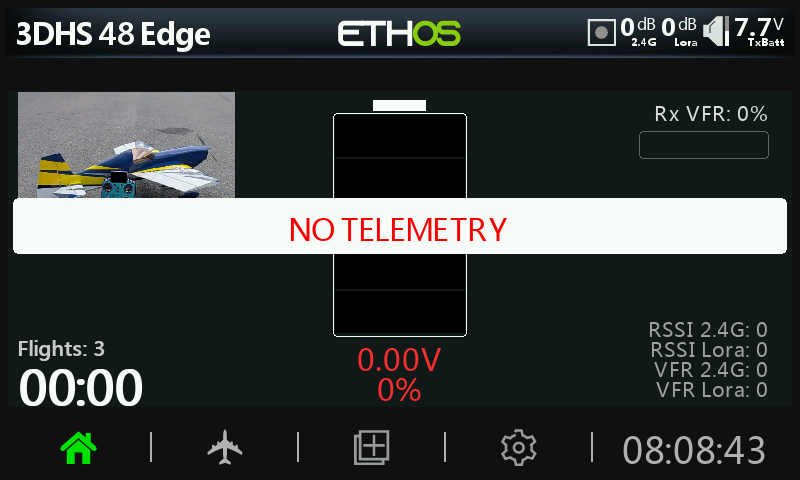

<p align="center">
  
</p>

MultiDash is a configurable telemetry dashboard for FrSky radios running ETHOS 26. It started as a UMX dashboard, but its telemetry fields can be used with TW, ACCESS, ACCST, DSM, and other setups as long as ETHOS can see the sensor.

This release includes pre-flight, in-flight, and flight-summary screens with automatic timing and persistent flight counts.

## System Requirements

ETHOS 26.1.0 RC4 or later

## Tested Hardware

FrSky X18  
FrSky X18RS

Partially simulator-tested on:

FrSky Twin Lite  
FrSky X20

MultiDash is designed for the large ETHOS widget size that keeps the normal system bars visible.

## Screenshots

### No Telemetry

<p align="center">
  
</p>

### TW Protocol

<table>
  <tr>
    <th>Pre-Flight</th>
    <th>In-Flight</th>
    <th>Flight Summary</th>
  </tr>
  <tr>
    <td></td>
    <td></td>
    <td></td>
  </tr>
</table>

### UMX / DSM Telemetry

<table>
  <tr>
    <th>Main Dashboard</th>
    <th>In-Flight</th>
    <th>Flight Summary</th>
  </tr>
  <tr>
    <td></td>
    <td></td>
    <td></td>
  </tr>
</table>

### Experimental Fuel Gauge

<p align="center">
  
</p>

The fuel gauge is experimental and is intended for a fuel sensor or percentage source that reports from 0 to 100. Battery voltage should use Battery mode instead.

## Major Features

- Pre-flight, in-flight, and color-coded flight-summary screens
- Battery tower or dial with automatic percentage calculation
- 1S through 12S support for LiPo, LiHV, Li-ion, LiFe, and NiCd
- Separate fuel mode for 0-100% fuel sensors
- Link quality bar, current, RPM, and four configurable telemetry fields
- Four configurable in-flight telemetry fields
- Normal or reversed arming switch with an adjustable delay
- Automatic flight timer and persistent flight counter
- Minimum and maximum statistics with adjustable warning thresholds
- Dark and light themes, per-model settings, and model images
- Nine selectable languages

Flights lasting at least 15 seconds are added to the flight counter. The count can also be edited in widget settings.

## Other Telemetry

MultiDash started as a dashboard for UMX aircraft and can be set up around DSM and MultiModule telemetry. Available sensors depend on the aircraft, receiver, and external module.

Assign any field to the link source or Telemetry 1-4. MultiDash uses the sensor name and records its minimum and maximum values. Threshold direction is adjustable because RSSI and VFR are high-is-good, while frame losses, fades, and holds are low-is-good.

## Battery and Fuel Modes

Battery mode calculates percentage from pack voltage, battery type, and cell count. Cell count can be selected or detected automatically.

Fuel mode expects a 0-100% fuel source. Raw battery voltage is not compatible with the fuel scale; an 11V source will be read as roughly 11%.

Default battery thresholds are per cell:

| Setting | Default |
|---|---:|
| Low | 3.45V |
| Mid | 3.75V |
| High | 4.15V |

## Suggested First Setup

1. Select Battery or Fuel.
2. Select the power source and optional percentage sensor.
3. Set battery type and cell count when using battery mode.
4. Select link quality, current, RPM, and any additional telemetry.
5. Select the arming switch, direction, and delay.
6. Adjust thresholds, then select a model image and language if needed.

## Installation

Download the zip and extract it into the SD card `SCRIPTS` directory:

```text
SCRIPTS:/MultiDash/
```

Model images are selected from `BITMAPS:/models`. Per-model settings are saved under `SCRIPTS:/MultiDash/models`.

Language-default installers and checksums are available in the
[`release`](release) folder. See the [RC4 release notes](RELEASE_NOTES_RC4.md)
for a short summary.

## Languages

English, German, Spanish, French, Italian, Polish, Portuguese, Chinese Simplified, and Chinese Traditional.

## Notes / Disclaimer

MultiDash has not been tested with every ETHOS radio, receiver, protocol, sensor, or widget size. Verify telemetry values and thresholds before relying on them. When reporting a problem, include the radio, ETHOS version, receiver or protocol, telemetry sources, screenshots, and steps to reproduce it.

## Credits

MultiDash was created and developed by Steven McCormack.

This project was made for FrSky's ETHOS 26 and takes inspiration from Rob Thomson's Rotorflight and DashX Lua suites.

## License

This project is released under the GNU General Public License. See
[LICENSE](LICENSE) for details.
