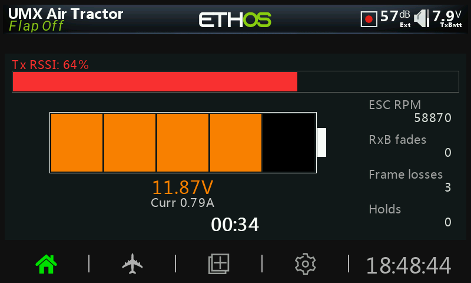
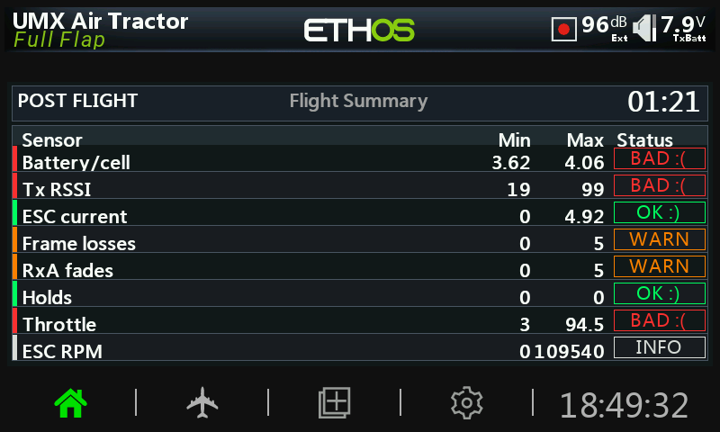

<p align="center">
  
</p>

**MultiDash** is an experimental telemetry dashboard built specifically for **ETHOS 26**.
It provides configurable live telemetry, battery display, session timing, custom telemetry fields, and a post-flight/session summary with min/max statistics and color-coded status feedback. Theoretically, this dashboard should be able to evolve to work with any protocol on any ETHOS 26 radio.

> **Current status:** MultiDash is still highly experimental. Layout, behavior, and configuration options may change in future releases. Use at your own risk.

---

## System Requirements

- **ETHOS 26.1.0 RC4 or later**
---

## Tested Hardware

- FrSky X18
- FrSky X18RS

Partially simulator-tested on:

- FrSky Twin Lite
- FrSky X20

---

## Widget Size Note

MultiDash has only been tested using the large ETHOS widget size that keeps the normal ETHOS top/bottom system bars visible, including model and battery/status information. It has not been tested with other widget sizes or with the larger/fullscreen-style widget layout that blocks or replaces the normal ETHOS model and battery/status areas. Layout issues may occur outside the tested widget size.

---

## Screenshots

### Main Dashboard


### In-Flight Dashboard



### Post-Flight Summary



---

## Features

- Configurable live telemetry dashboard
- Battery display with per-cell scaling
- Current display
- RPM display
- Link quality / RSSI-style display
- Four configurable telemetry fields
- Session timer
- Arm switch support
- Normal or reversed arm switch logic
- Configurable arming delay
- In-flight screen
- Post-flight/session summary
- Min/max statistics
- Color-coded status feedback
- Per-model settings
- Optional model image/logo support
- Separate language builds for smaller Lua files

---

## RC2 Notes

RC2 is mainly a cleanup, optimization, and language-build release. Instead of one large Lua file with every language included, RC2 uses separate language-specific builds. This keeps each `main.lua` smaller and lighter on the radio. RC2 also includes the MultiDash logo image inside each `MultiDash` folder as:

```text
MultiDash/MultiDash.png
```

This version also changes how settings save. RC1 was writing settings too often. RC2 should only save settings after something changes. Bitmap loading was also made safer so a bad or missing image should be less likely to cause issues.

---

## Included RC2 Language Builds

- English
- Czech
- German
- Spanish
- French
- Italian
- Polish
- Portuguese
- Chinese Simplified
- Chinese Traditional

Each language zip contains a complete `MultiDash` folder.

---

## Suggested First Setup

After adding MultiDash to an ETHOS screen, configure:

1. Battery source
2. Cell count
3. Link quality / RSSI source
4. Current source
5. RPM source, if used
6. Custom telemetry fields, if used
7. Arm switch
8. Arm switch direction
9. Battery thresholds

Default battery thresholds are per-cell:

| Setting | Default |
|---|---:|
| Low | `3.45V` |
| Mid | `3.75V` |
| High | `4.15V` |

---

## Status Labels

Post-flight/session status labels include:

- `OK :)`
- `WARN`
- `BAD :(`
- `INFO`

---

## Final Notes / Disclaimer

MultiDash is still **highly experimental**.

It has not been tested across all ETHOS 26 radios, telemetry systems, receivers, protocols, widget sizes, or model types. Layout, behavior, and configuration options may change in future releases. Please message me with any issues you run into. Include as much detail as possible, such as your radio model, ETHOS version, receiver/protocol, telemetry sources used, screenshots if available, and steps to reproduce the issue. Use at your own risk and verify all telemetry values before relying on them.


## Credits

MultiDash was created and developed by Steven McCormack.

This project is experimental and is being developed for FrSky's ETHOS 26. it takes inspiration from Rob Thomson's Lua scripts for Rotorflight and DashX.

---

## License

This project is released under the **GNU General Public License**.

See the `LICENSE` file for details.
