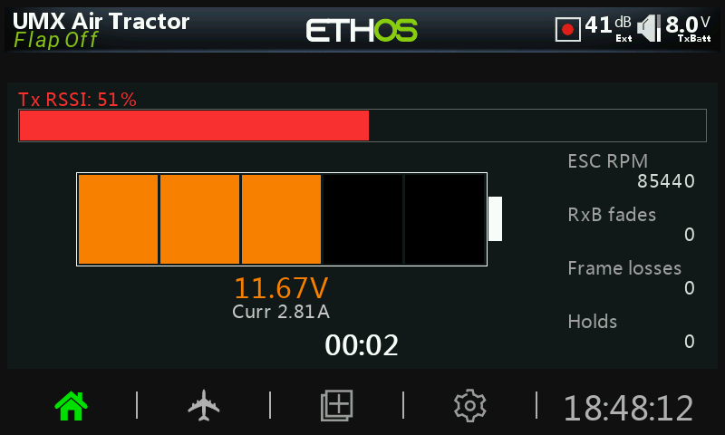

# MultiDash

**MultiDash** is an experimental telemetry dashboard for **FrSky ETHOS 26 only**.

It is designed as a flexible, evolving dashboard for RC telemetry setups. MultiDash focuses on clean live telemetry, configurable battery scaling, session timing, user-selectable telemetry fields, and a post-session summary screen with min/max statistics.

> **Experimental status:** MultiDash is still actively evolving. Features, layout, settings, telemetry behavior, and supported use cases may change between versions.

> **Tested hardware:** MultiDash has only been tested on the **FrSky X18** and **FrSky X18RS** so far.

---

## RC1 Release Status

MultiDash RC1 is built for **FrSky ETHOS 26.1.0 RC4 or later**.

Tested hardware:

- FrSky X18
- FrSky X18RS
- Partially simulator-tested on FrSky Twin Lite
- Partially simulator-tested on FrSky X20

MultiDash is still **highly experimental**. Please report issues with your radio model, ETHOS version, receiver/protocol, telemetry sources, screenshots if available, and steps to reproduce the issue.

---

## Screenshots

### Main dashboard

### In-flight telemetry view

### In-flight warning/state example

### Post-flight summary

---

## What MultiDash Does

MultiDash provides a customizable ETHOS 26 telemetry dashboard with live and post-session views.

The project started around aircraft telemetry, but it is not intended to stay aircraft-only. It is being built as a flexible telemetry display foundation for many RC use cases that can provide useful ETHOS telemetry sources.

---

## Main Views

### Main / idle dashboard

The main dashboard can display:

- Model name from ETHOS
- Flap/status text
- Optional model image
- Battery display
- Link quality / RSSI-style telemetry
- Current
- RPM
- Custom telemetry fields
- Timer

### In-flight / active session view

The in-flight screen is intended for quick readability while the model is active.

It can display:

- Large battery graphic
- Battery voltage
- Current draw
- Link quality bar
- Session timer
- Four user-selectable telemetry fields

### Post-flight / post-session summary

After disarming, MultiDash shows a post-flight summary with:

- Session duration
- Battery-per-cell min/max
- Link quality min/max
- Current min/max
- RPM min/max
- Custom telemetry min/max
- Color-coded status boxes

Post-flight status labels include:

- `OK :)`
- `WARN`
- `BAD :(`
- `INFO`

RPM is placed at the bottom of the post-flight table.

---

## ETHOS Compatibility

MultiDash is intended for:

- **FrSky ETHOS 26 only**
- Color-screen FrSky radios running ETHOS 26

Currently tested only on:

- **FrSky X18**
- **FrSky X18RS**

It is **not intended for ETHOS 1.x**, OpenTX, EdgeTX, or non-ETHOS radios.

Other ETHOS 26 radios may work, but they are not confirmed yet.

---

## Features

- ETHOS 26 Lua dashboard
- Configurable telemetry sources
- Battery-per-cell display
- Battery bar scaling from configured battery thresholds
- Current display
- RPM display
- Link quality display
- Four custom telemetry fields
- Arm switch selection
- Normal or reversed arm switch logic
- Configurable arming delay
- In-flight screen
- Post-flight summary screen
- Per-model settings
- Color-coded thresholds
- Min/max stat tracking
- Optional model image support
- Dark/light theme support, depending on current script version

---

## Battery Defaults

Default battery thresholds are per-cell:

| Setting | Default |
|---|---:|
| Low | `3.45V` |
| Mid | `3.75V` |
| High | `4.15V` |

Battery display scaling follows the configured battery settings in the widget. If the battery display looks wrong, check:

- Battery telemetry source
- Cell count
- Low/mid/high battery settings

For LiHV or other pack types, adjust the high value to match the pack chemistry and your preferred full-cell voltage.

---

## Custom Telemetry Fields

MultiDash includes four general-purpose telemetry slots.

Default custom telemetry thresholds are:

| Field | Low | Mid | High |
|---|---:|---:|---:|
| Telemetry 1 | `0` | `0` | `0` |
| Telemetry 2 | `0` | `0` | `0` |
| Telemetry 3 | `0` | `0` | `0` |
| Telemetry 4 | `0` | `0` | `0` |

These fields are intentionally generic so the dashboard can evolve beyond one specific model type or telemetry setup.

---

## Arm Switch and Session Timing

MultiDash can use a selected arm switch to control session timing.

Configurable options include:

- Arm switch
- Arm switch direction
- Arming delay
- In-flight screen on/off

The session timer starts after the arm switch has been active for the configured delay. When the switch returns to the disarmed state, MultiDash switches to the post-flight summary.

---

## Installation

1. Download the latest `main.lua` from this repository.
2. Copy it to the correct ETHOS Lua widget/script folder on your radio SD card.
3. Keep the script folder and file naming consistent with how ETHOS expects widgets to be installed.
4. Restart Lua scripts or reboot the radio if needed.
5. Add MultiDash to an ETHOS screen.
6. Open the widget settings and assign telemetry sources.

> Folder layout can vary depending on how you organize scripts on your radio. If MultiDash does not appear, confirm the folder name, file name, and ETHOS Lua script location.

---

## Suggested First Setup

Start with these settings:

| Setting | Suggested value |
|---|---:|
| Cell count | `0` for auto, or exact pack cell count |
| Battery low | `3.45V` |
| Battery mid | `3.75V` |
| Battery high | `4.15V` |
| Arm delay | `5 seconds` |

Then assign:

1. Battery source
2. Link quality / RSSI source
3. Current source
4. RPM source, if used
5. Custom telemetry fields 1–4, if used
6. Arm switch and direction

---

## Notes and Limitations

- Experimental project.
- ETHOS 26 only.
- Only tested on X18 and X18RS.
- Layout may need adjustment on other radios.
- Telemetry source names depend on receiver, protocol, sensors, and model setup.
- Behavior may change between releases.
- Not guaranteed for critical flight information.
- Use at your own risk.

---

## Project Goals

MultiDash is intended to grow into a flexible ETHOS 26 telemetry dashboard.

Current goals:

- Keep the display readable
- Keep configuration simple
- Support flexible telemetry sources
- Improve post-session stats
- Support more model/use cases over time
- Stay lightweight enough for ETHOS radios

---

## Credits

Created by **Steven McCormack**.

MultiDash is an evolving ETHOS telemetry dashboard project. It is not currently claiming broad compatibility beyond the tested ETHOS 26 X18/X18RS setup.

---

## License

This project is released under the **MIT License**.

See the `LICENSE` file for details.
