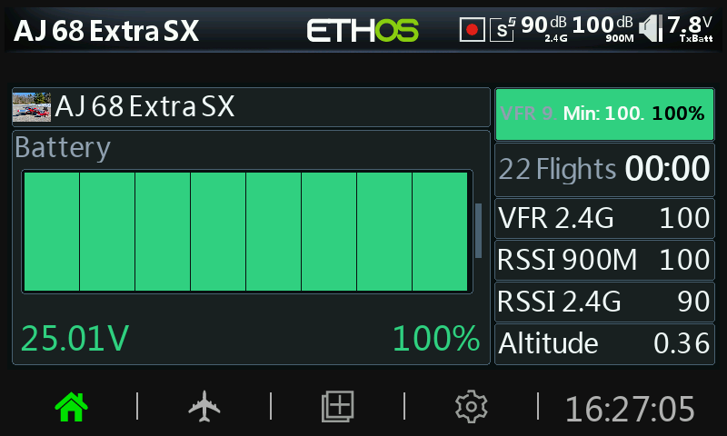
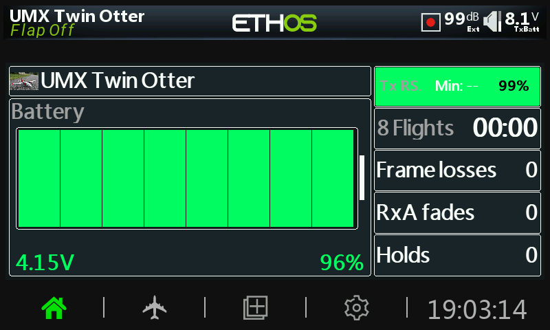
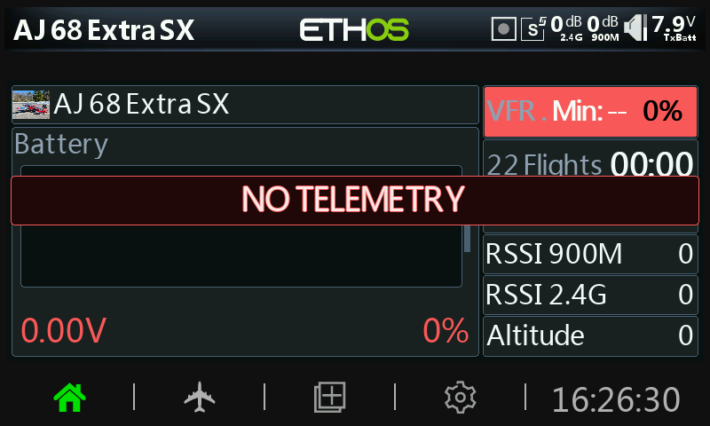
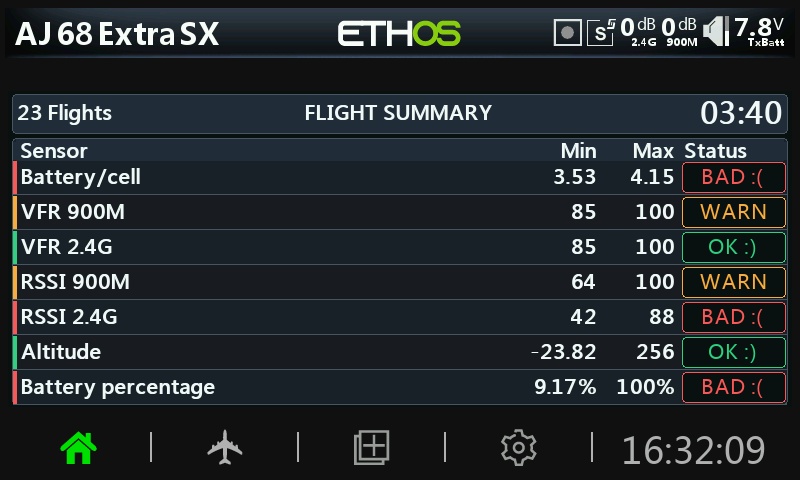

  

# MultiDash 2.0

**V2.0 is COMING SOON!** 

MultiDash is a configurable telemetry dashboard for FrSky ETHOS radios. One widget supports electric aircraft, dual-battery electric aircraft, rotorwing models, fuel-powered aircraft, and general telemetry.

  
  

  
  

V2.0 combines the redesigned dashboard, dual-battery and rotorwing layouts, consistent text scaling, manual telemetry setup, audio cues, per-model storage, and a larger post-flight summary in one release.

## Requirements

- ETHOS 1.6 or newer
- One Single Large Widget zone
- Telemetry sensors supported by ETHOS

## Features

- Pre-flight, in-flight, and post-flight views
- Electric, Electric Dual Battery, Rotorwing, Fuel, and General operating profiles
- Horizontal dual-battery display with separate FLVSS readings and combined series voltage
- Per-pack voltage, per-cell voltage, percentage, sensor state, and cell-normalized pack mismatch warning
- Battery tower and battery-only dial gauge styles
- LiPo, LiHV, Li-ion, LiFe, and NiCd voltage curves and chemistry-specific thresholds
- Link, current, RPM, status, timer, and four general telemetry fields
- Explicit RPM warning and maximum thresholds
- Minimum/maximum flight statistics and persistent flight count
- Dark/light themes, three text sizes, model images, and per-model settings
- English, German, Spanish, French, Italian, Polish, Portuguese, Simplified Chinese, and Traditional Chinese
- Flashing no-telemetry warning, one-time telemetry-acquired beep, and armed/disarmed voice cues

## Operating profiles

Select one profile under **Model Settings → Operating profile**:

| Profile | Intended setup |
|---|---|
| Electric | One flight battery |
| Electric Dual Battery | Two monitored batteries, including two 6S packs used as a 12S system |
| Rotorwing | Battery plus the paired rotor RPM gauge |
| Fuel | Fuel or tank percentage using the original E / 1/2 / F dial |
| General | Flexible telemetry without a specialized main gauge |

Profiles replace the older overlapping Fuel, Dual Battery, and Rotorwing toggles. Legacy flags are still saved for backward configuration compatibility.

## Dual-battery setup

1. Select **Electric Dual Battery**.
2. Set Battery 1 Power Source to the first FLVSS.
3. Set Battery 2 Power Source to the second FLVSS.
4. Optionally set Total Pack Voltage Source to a separate full-pack sensor. Without one, MultiDash adds Battery 1 and Battery 2.
5. Select the chemistry and cells per battery. For two 6S packs, set **6**.
6. Verify both pack voltages, per-cell values, and total series voltage before flight.
7. Adjust the per-cell pack mismatch warning and alert thresholds if needed.

Cell count is always set manually because pack voltage alone cannot distinguish a full lower-cell pack from a depleted higher-cell pack.

## Telemetry protocols

MultiDash reads standard numeric ETHOS sources rather than protocol packets. Source selection is always manual and works with ACCESS, ACCST, TD, TW, CRSF/ELRS, mLRS, and multimodule telemetry when ETHOS exposes the sensor. Set link thresholds appropriate to the selected source's unit. A plain RSSI source with no reported unit is kept as a raw whole number; only `%` units and explicit LQ, RQly, VFR, or Quality names are treated as percentages.

## Installation

Download one of the two assets from [GitHub Releases](https://github.com/stevemccormack/MultiDash-ETHOS-26/releases):

- MultiDash_ETHOS_installer.zip for ETHOS Suite
- MultiDash_manual_install.zip for manual SD-card installation

The manual ZIP already contains the required MultiDash/ folder. Copy it so the final path is SCRIPTS:/MultiDash. Do not add another Scripts or MultiDash layer.

## Upgrading

MultiDash reads V1.3.3 and V2.0 RC1 per-model configuration files. Existing sources, thresholds, images, themes, language, flight count, arming, and in-flight fields are retained. On first load, the old power toggles are converted to the closest operating profile.

Review these new RC2 settings before flight:

- Operating profile
- Cells per battery
- Chemistry-specific cell thresholds
- RPM warning
- Pack mismatch warning/alert
- Minimum flight seconds

## Safety

Telemetry dashboards are advisory. Confirm sensor assignment, pack wiring, cell count, voltage, chemistry, thresholds, arming behavior, and failsafe operation on the ground. A missing sensor is shown separately in dual-battery mode; the remaining valid pack continues to display.

## Development

MultiDash/ is the only runtime source tree. Run `powershell -NoProfile -ExecutionPolicy Bypass -File tools/package.ps1` to build the source, ETHOS installer, and manual-install packages. The build verifies the three protected audio hashes before packaging. Runtime, migration, language, lifecycle, and screen-matrix checks live under tests/.

## Credits and license

MultiDash was created and developed by Steven McCormack. It was made for FrSky ETHOS 26 and takes inspiration from Rob Thomson's Rotorflight and DashX Lua suites.

This project is released under the GNU General Public License. See [LICENSE](LICENSE).

## License

This project is released under the GNU General Public License. See
[LICENSE](LICENSE) for details.
